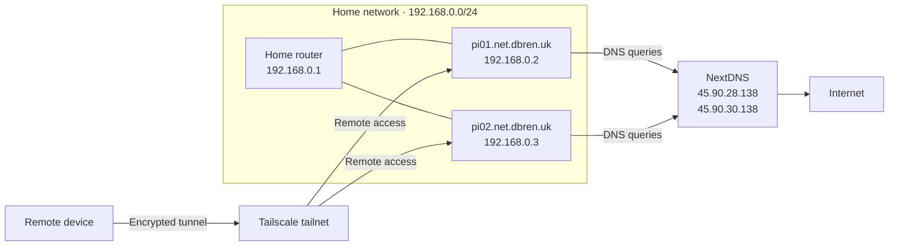

# :material-lan: Home Network Architecture

This diagram shows the current home network, including its NextDNS and
Tailscale integrations.

See the [DNS documentation](dns.md) for details about NextDNS and its rewrite
records. Tailscale provides encrypted remote access to the Raspberry Pi
devices from outside the home network.
