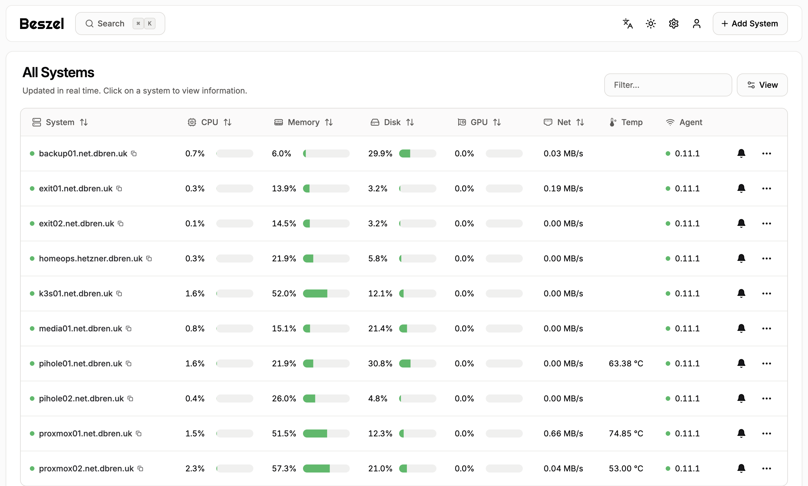

# :octicons-graph-16: Beszel

[Beszel](https://beszel.dev/) is a simple, lightweight server monitoring solution that I use to monitor all my Homelab devices.

The Beszel Hub is hosted on a VPS deployed on [Hetzner Cloud](hetzner.md). The Beszel Hub is deployed using [Docker Compose](https://github.com/dbrennand/home-ops/tree/dev/docker/beszel) using the method documented [here](../docker-compose.md).



Each Homelab device has the [Beszel binary agent](https://beszel.dev/guide/what-is-beszel#architecture) which communicates system metrics to the Hub. I deploy this agent using my [dbrennand.beszel](https://github.com/dbrennand/ansible-role-beszel) Ansible role which I run from an Ansible playbook [`playbook-beszel-agent.yml`](https://github.com/dbrennand/home-ops/blob/dev/ansible/playbooks/playbook-beszel-agent.yml).

## :simple-tailscale: Tailscale Sidecar

Alongside the Beszel Hub is a Tailscale [sidecar](https://tailscale.com/blog/docker-tailscale-guide) container which allows the Hub to communicate with devices on my home network, and only be accessible over Tailscale using [Tailscale serve](https://tailscale.com/kb/1312/serve).

The sidecar container accepts my [Tailnet's configured DNS servers](https://github.com/dbrennand/home-ops/blob/dev/docker/beszel/docker-compose.yml#L11) and [accepts subnet routes](https://github.com/dbrennand/home-ops/blob/dev/docker/beszel/docker-compose.yml#L10). This is what allows the Beszel Hub to communicate with devices on my home network.

## Discord Webhook Notifications

The Beszel Hub is configured to send notifications into a Discord channel when certain system thresholds are breached for over 10 minutes.

```
generic://discord.com/api/webhooks/...?template=json&messagekey=content
```
