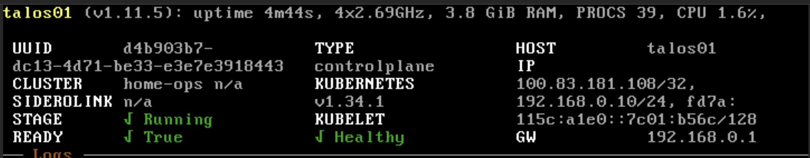

# :simple-talos: Talos Linux

In my Homelab I have a single [Talos Linux](https://www.talos.dev/) node which runs various Kubernetes workloads.

!!! quote "What is Talos Linux?"

    Talos Linux is a Kubernetes optimized Linux distro.

    It’s designed to be as minimal as possible while still maintaining practicality. For these reasons, Talos has a number of features unique to it:

    1. API managed
    2. Immutable file system
    3. Minimal packages
    4. Secure by default

## Talhelper & Machine Configuration

Talos Linux's node state is defined by a [machine configuration](https://docs.siderolabs.com/talos/v1.11/reference/configuration/overview). Machine configuration is applied to the node during initial deployment. The [`talhelper`](https://budimanjojo.github.io/talhelper/latest/) CLI tool generates the machine configuration declaratively from three files:

| File Name                                                                                                     | Description                                                                                       |
| ------------------------------------------------------------------------------------------------------------- | ------------------------------------------------------------------------------------------------- |
| [`talconfig.yaml`](https://github.com/dbrennand/home-ops/blob/main/kubernetes/talos/talconfig.yaml)           | Primary configuration file used to generate the machine configuration.                            |
| [`talenv.sops.yaml`](https://github.com/dbrennand/home-ops/blob/main/kubernetes/talos/talenv.sops.yaml)       | Stores environment variables which are templated using `envsubst` into the machine configuration. |
| [`talsecret.sops.yaml`](https://github.com/dbrennand/home-ops/blob/main/kubernetes/talos/talsecret.sops.yaml) | Stores secrets used by Talos.                                                                     |

## Prerequisites

1. Install the required CLI tools to manage Talos:

    ```bash
    brew install talhelper siderolabs/tap/sidero-tools kubectl sops age
    ```

2. Configure `sops`:

    !!! info

        [Referenced Documentation](https://budimanjojo.github.io/talhelper/latest/guides/#configuring-sops-for-talhelper).

    ```bash
    mkdir -pv ~/.config/sops/age
    mkdir -pv ~/Library/Application Support/sops/age
    age-keygen -o ~/.config/sops/age/keys.txt
    ln -s ~/.config/sops/age/keys.txt ~/Library/Application\ Support/sops/age/keys.txt
    ```

3. Configure `sops` for `talhelper` by adding the age public key to the `kubernetes/.sops.yaml` file:

    ```yaml
    ---
    creation_rules:
      - age: >-
          <age-public-key> # Get this in the keys.txt file from previous step
    ```

## Talos ISO

[ISO image](https://github.com/siderolabs/talos/releases/download/v1.11.5/metal-amd64.iso) I used when originally deploying my Talos node.

## Deploy the Talos ISO on Proxmox

1. Download the ISO to the Node 1 `local` storage.

2. Navigate to `proxmox01` > `Create VM`.

3. Provide the following details for `General` and click **Next**:

    | Setting       | Value       |
    | ------------- | ----------- |
    | Name          | `talos01`   |
    | ID            | 100         |
    | Node          | `proxmox01` |
    | Start at boot | ❌           |

4. Under `OS`, select the storage where the ISO was downloaded to and choose the `metal-amd64.iso`. Click **Next**.

5. Under `System`, select the `VirtIO SCSI Single` controller and `Qemu Agent` and click **Next**.

6. Provide the following details for `Disks` and click **Next**:

    | Setting       | Value                  |
    | ------------- | ---------------------- |
    | Bus/Device    | `SCSI`                 |
    | Storage       | `lv-ssd-crucial`       |
    | Size          | `100GiB`               |
    | Format        | `Raw disk image (raw)` |
    | Discard       | ✅                      |
    | SSD Emulation | ✅                      |
    | IO thread     | ✅                      |
    | Backup        | ✅                      |

    | Setting       | Value                  |
    | ------------- | ---------------------- |
    | Bus/Device    | `SCSI`                 |
    | Storage       | `lv-ssd-crucial`       |
    | Size          | `200GiB`               |
    | Format        | `Raw disk image (raw)` |
    | Discard       | ✅                      |
    | SSD Emulation | ✅                      |
    | IO thread     | ✅                      |
    | Backup        | ✅                      |

7. Provide the following details for `CPU` and click **Next**:

    | Setting | Value  |
    | ------- | ------ |
    | Cores   | `4`    |
    | Type    | `host` |

8. Provide the following details for `Memory` and click **Next**:

    | Setting           | Value  |
    | ----------------- | ------ |
    | Memory (MiB)      | `4096` |
    | Ballooning Device | ✅      |
    | Minimum Memory    | `4096` |

9. Leave `Network` as default, click **Next** and confirm deployment.

10. Start the `talos01` VM and open the console to begin the installation.

11. In the console, press E to edit the grub menu option and add the end of the kernel boot options enter:

    ```
    ip=192.168.0.10::192.168.0.1:255.255.255.0::eth0:off
    ```

12. Press CTRL + X to boot.

Talos will now have booted into maintenance mode and is waiting for machine configuration to be applied. It should look like the screenshot below:


## Deploying Talos

### Generating and applying the Machine Configuration

!!! info

    [Referenced Documentation](https://budimanjojo.github.io/talhelper/latest/getting-started/#you-are-starting-from-scratch).

These steps only need to be performed during the initial set up of Talos and assume you've already created the `talconfig.yaml`, `talenv.sops.yaml` and `.sops.yaml` files.

```bash
cd kubernetes/talos
talhelper gensecret > talsecret.sops.yaml
sops -e -i talsecret.sops.yaml
sops -e -i talenv.sops.yaml
talhelper genconfig
talosctl apply-config --talosconfig=./clusterconfig/talosconfig --nodes=192.168.0.10 --file=./clusterconfig/home-ops-talos01.yaml --insecure
```

### Bootstrap Talos

1. Bootstrap etcd:

    ```bash
    talosctl bootstrap --talosconfig=./clusterconfig/talosconfig --nodes=192.168.0.10
    ```

2. Retrieve the `kubeconfig`:

    ```bash
    talosctl kubeconfig --talosconfig=./clusterconfig/talosconfig --nodes=192.168.0.10
    ```

Once the machine configuration has finished applying and `etcd` has finished set up the node should show as below:


