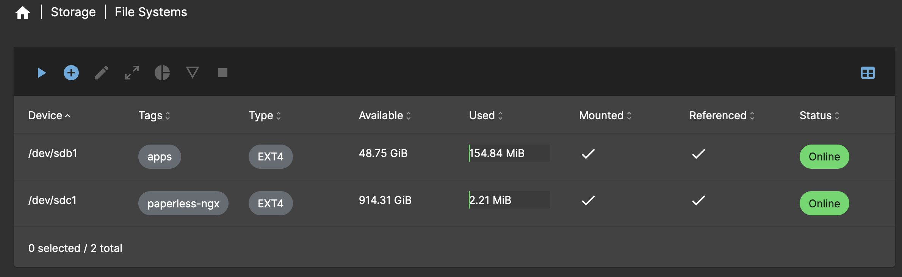
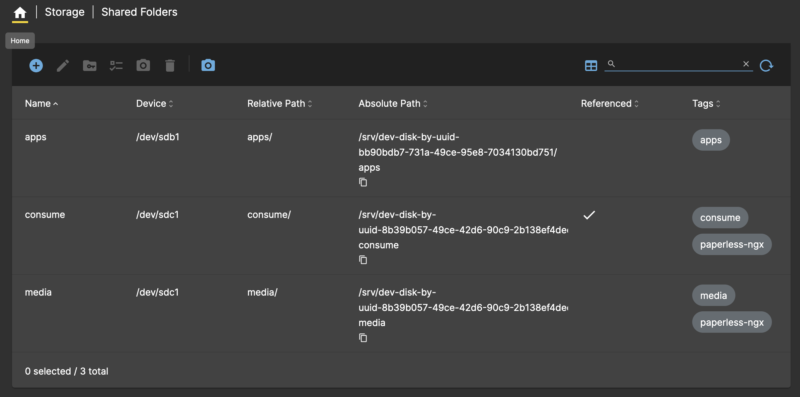
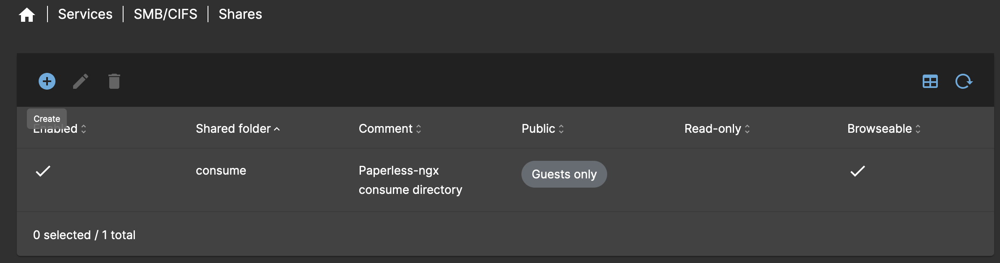

# :material-folder: Media Server

Media server for hosting files and various containerised services.

!!! quote "What is OpenMediaVault?"

    [OpenMediaVault](https://www.openmediavault.org/) is the next generation network attached storage (NAS) solution based on Debian Linux. It contains services like SSH, (S)FTP, SMB/CIFS, RSync and many more ready to use.

## Deployment

The media server is deployed as a VM on Proxmox using the [OpenMediaVault ISO](https://www.openmediavault.org/download.html).

1. Download the ISO to the Node 1 (Primary) storage.

2. Navigate to `proxmox01` > `Create VM`.

3. Provide the following details for `General` and click **Next**:

    | Setting       | Value       |
    | ------------- | ----------- |
    | Name          | `media01`   |
    | Node          | `proxmox01` |
    | Start at boot | ❌           |

4. Under `OS`, select the storage where the ISO was downloaded to and choose the Proxmox Backup Server ISO image. Click **Next**.

5. Under `System`, select the `VirtIO SCSI Single` controller and click **Next**.

6. Provide the following details for `Disks` and click **Next**:

    | Setting       | Value                  |
    | ------------- | ---------------------- |
    | Bus/Device    | `SCSI`                 |
    | Storage       | `local-lvm`            |
    | Size          | `50GiB`                |
    | Format        | `Raw disk image (raw)` |
    | Discard       | ✅                      |
    | SSD Emulation | ✅                      |

    | Setting       | Value                  |
    | ------------- | ---------------------- |
    | Bus/Device    | `SCSI`                 |
    | Storage       | `lv-ssd-samsung`       |
    | Size          | `930GiB`               |
    | Format        | `Raw disk image (raw)` |
    | Discard       | ✅                      |
    | SSD Emulation | ✅                      |

    | Setting       | Value                  |
    | ------------- | ---------------------- |
    | Bus/Device    | `SCSI`                 |
    | Storage       | `lv-ssd-crucial`       |
    | Size          | `50GiB`                |
    | Format        | `Raw disk image (raw)` |
    | Discard       | ✅                      |
    | SSD Emulation | ✅                      |

7. Provide the following details for `CPU` and click **Next**:

    | Setting | Value  |
    | ------- | ------ |
    | Cores   | `4`    |
    | Type    | `host` |

8. Provide the following details for `Memory` and click **Next**:

    | Setting           | Value  |
    | ----------------- | ------ |
    | Memory (MiB)      | `8192` |
    | Ballooning Device | ✅      |
    | Minimum Memory    | `1024` |

9. Leave `Network` as default, click **Next** and confirm deployment.

10. Start the `media01` VM and open the console to begin the installation.

11. Follow the on-screen instructions to install OpenMediaVault, when prompted enter the following details:

      | Setting         | Value           |
      | --------------- | --------------- |
      | Hostname        | `media01`       |
      | Domain Name     | `net.dbren.uk`  |
      | Email           | Enter email     |
      | Password        | Enter password  |
      | Default Gateway | `192.168.0.1`   |
      | Subnet Mask     | `255.255.255.0` |
      | IP Address      | `192.168.0.10`  |

12. Once installation has completed, login to the web interface using the FQDN and credentials entered during installation.

## Post Installation

!!! info

    Where required, make sure to apply changes before moving on to the next step. A yellow box will appear after certain operations if this is necessary.

1. Navigate to `System` > `Date & Time` and set the time zone to `Europe/London`.

2. Under `Storage` > `File Systems`, click the `+` symbol and use the following configuration, repeating for each file system:

    | Setting     | Value      |
    | ----------- | ---------- |
    | File System | `EXT4`     |
    | Device      | `/dev/sdb` |
    | Label       | `apps`     |

    | Setting     | Value           |
    | ----------- | --------------- |
    | File System | `EXT4`          |
    | Device      | `/dev/sdc`      |
    | Label       | `paperless-ngx` |

    Click **Save** when finished.

    The file system configuration should look like below:

    

3. Navigate to `Storage` > `Shared Folders` and click the `+` symbol and use the following configuration, repeating for each shared folder:

    | Setting       | Value                                                             |
    | ------------- | ----------------------------------------------------------------- |
    | Name          | `apps`                                                            |
    | Device        | `/dev/sdb1`                                                       |
    | Permissions   | `Administrator: read/write, Users: read/write, Others: read-only` |
    | Relative Path | `apps/`                                                           |
    | Tags          | `apps`                                                            |

    | Setting       | Value                      |
    | ------------- | -------------------------- |
    | Name          | `consume`                  |
    | Device        | `/dev/sdc1`                |
    | Permissions   | `Everyone: read/write`     |
    | Relative Path | `consume/`                 |
    | Tags          | `consume`, `paperless-ngx` |

    | Setting       | Value                                                             |
    | ------------- | ----------------------------------------------------------------- |
    | Name          | `media`                                                           |
    | Device        | `/dev/sdc1`                                                       |
    | Permissions   | `Administrator: read/write, Users: read/write, Others: read-only` |
    | Relative Path | `media/`                                                          |
    | Tags          | `apps`                                                            |
    | Tags          | `media`, `paperless-ngx`                                          |

    The shared folder configuration should look like below:

    

4. Navigate to `Services` > `SMB/CIFS` > `Settings` and configure the following settings:

    | Setting                  | Value  |
    | ------------------------ | ------ |
    | Enabled                  | ✅      |
    | Browsable                | ✅      |
    | Minimum protocol version | `SMB3` |

5. Navigate to `Services` > `SMB/CIFS` > `Shares` and click the `+` symbol to add a new share with the following configuration:

    | Setting             | Value                              |
    | ------------------- | ---------------------------------- |
    | Enabled             | ✅                                  |
    | Shared Folder       | `consume [consume, paperless-ngx]` |
    | Comment             | `Paperless-ngx consume directory`  |
    | Public              | Guests only                        |
    | Browsable           | ✅                                  |
    | Inherit ACLs        | ✅                                  |
    | Inherit Permissions | ✅                                  |

    The share configuration should look like below:

    

6. Navigate to `Services` > `SSH` and configure the following settings:

    | Setting                   | Value |
    | ------------------------- | ----- |
    | Password Authentication   | ❌     |
    | Public Key Authentication | ✅     |
